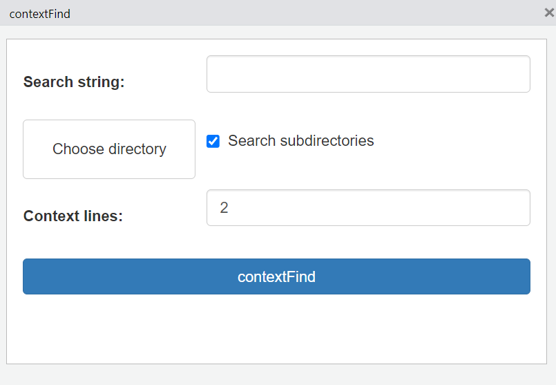
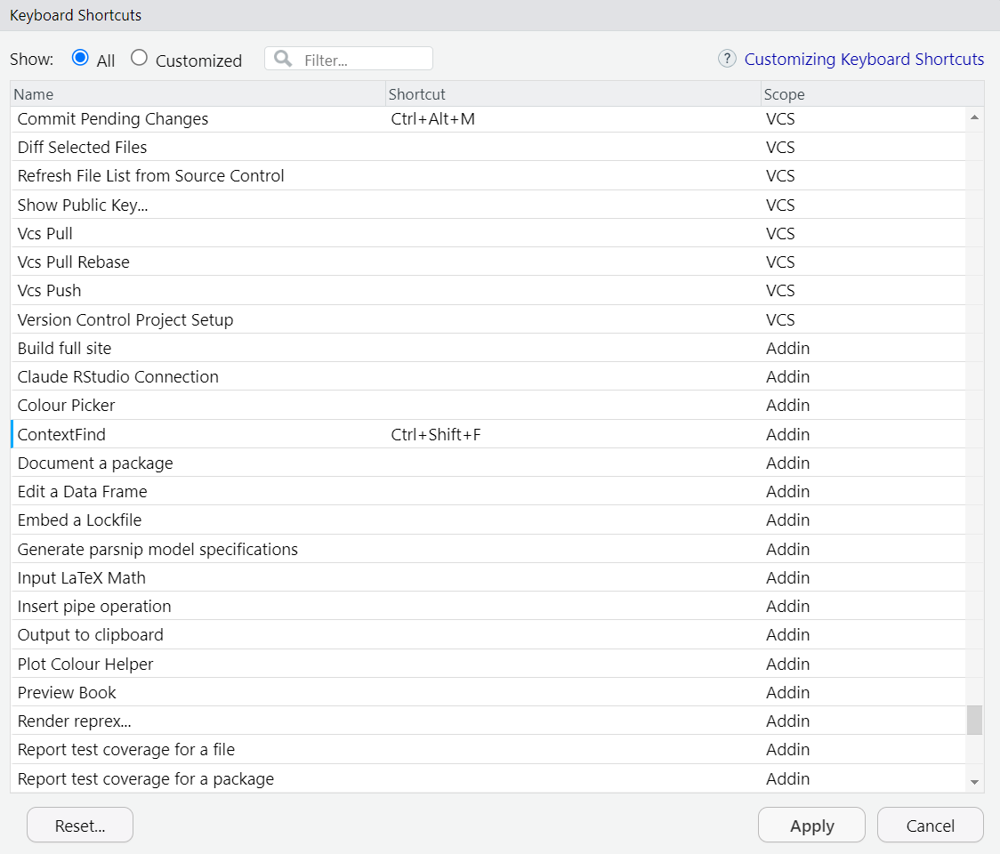
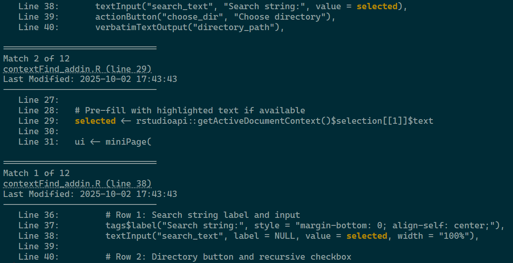

<!-- README.md is generated from README.Rmd. Please edit that file -->

# contextFind 

<!-- badges: start -->

[](https://cran.r-project.org/package=contextFind)
[](https://github.com/s87jackson/contextFind/actions/workflows/R-CMD-check.yaml)
[](https://CRAN.R-project.org/package=contextFind)

<!-- badges: end -->

The goal of `contextFind` is to help developers find relevant parts of
their code, especially helpful when code expands beyond a single file,
such as with Shiny applications.

The package includes an addin to bind `contextFind()` to a hotkey (e.g.,
Ctrl+Shift+F). This opens a mini shiny application with inputs for the
search string, the directory, whether to search subdiretories, and how
many lines of context to print before and after the found search string:

<figure>

<figcaption aria-hidden="true">The contextFind gadget with inputs for
search string and context lines, a button to choose the directory, and a
checkbox to search subdirectories.</figcaption>
</figure>

Clicking the contextFind button prints the results to the console. For
each result (match), `contextFind()` provides a clickable labelled link
indicating the file and line number of the result, followed by
`contextLines=2` lines before and after the occurrence, with the found
string highlighted in yellow. The results are ordered with most recently
modified files at the bottom of the list for ease of reading in the
console.

## Installation

You can install the latest version of `contextFind` from
[GitHub](https://github.com/) with:

``` r
devtools::install_github("s87jackson/contextFind")
```

or the CRAN stable release with:

``` r
install.packages("contextFind")
```

## Use

After installing contextFind, restart RStudio, then set contextFind to a
hotkey by selecting Tools \>\> Modify Keyboard Shortcuts:

<figure>

<figcaption aria-hidden="true">RStudio’s Keyboard Shortcuts
interface.</figcaption>
</figure>

Now typing Ctrl+Shift+F opens the gadget to perform the search. If text
is higlighted when you type the hotkey, it will be passed to the gadget
automatically. In the example below, we search for the string ‘selected’
and see the results:

<figure>

<figcaption aria-hidden="true">Example results for ‘selected’ in the
package’s files.</figcaption>
</figure>
